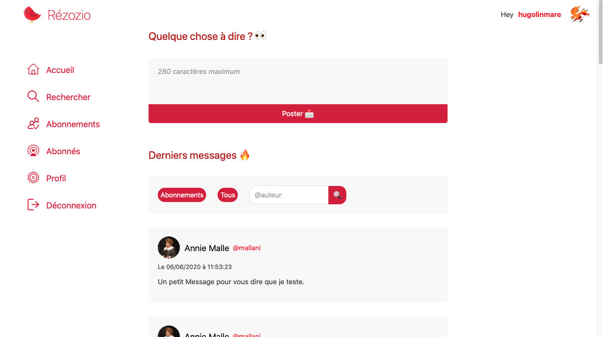

# Rézozio (projet d'étude)

**Rézozio** est un projet réalisé dans le cadre de mes études, c'est un réseau
social fortement inspiré de Twitter.

## Contexte du projet 📖

Ce projet nous a été demandé dans le but d'évaluer nos connaissances en PHP et
JavaScript. Certaines contraintes étaient présentes :
* Créer des services en PHP qui renvoient des réponses au format JSON
* Les actions doivent être fluides, aucun rechargement de la page n'est autorisé
* Utiliser une base de données **PostgreSQL**
* Ne pas utiliser de **librairies externes**
* Utiliser la structure de dossiers & fichiers vue en travaux dirigés
* (Utiliser la version 5.6 de PHP...)

## Réalisation 🎨

Pour arriver au terme de ce projet j'ai dû répartir les tâches à effectuer en 
plusieurs étapes :
1. Créer la connexion à la base de données et les requêtes pour intéragir par la 
suite avec la base de données (dans un objet DataLayer pouvant être un singleton
au passage)
2. Créer les différents services à l'aide de l'objet DataLayer et d'un autre objet 
RequestParameters permettant de vérifier les entrées utilisateurs
3. Créer l'interface graphique de l'application
4. Intégrer l'API à l'aide de JavaScript et de son API fetch
5. Tester
6. Corriger les problèmes
7. **LAUNCH** 🚀

## Résumé de l'expérience 🧘‍♂️

J'ai beaucoup apprit en faisant ce projet, c'était très fun à faire si l'on enlève
les petits inconvénients. L'ayant fait sur 8 jours, j'ai pu mettre à l'épreuve mon
sens de l'organisation en mettant en place une roadmap par exemple. J'ai rencontré
plusieurs problèmes de conceptions pour la partie front très libre, mais j'ai su
tirer parti de mes connaissances pour palier à ces obstacles.  
Je ne suis pas particulièrement fier de l'entièreté du code produit, et ce à cause
de la contrainte de temps restant pour finir le projet.  

Les + :
+ Ce projet était intéressant du fait qu'il fallait absolument tout penser par 
soi-même, principalement pour la partie front-end qui aura laissé une grande liberté
+ Commencer presque from scratch permet de comprendre les mécaniques qui peuvent se 
cacher derrière de gros frameworks notamment

Les - :
- La structure de dossiers & fichiers imposée (pour des raisons de testabilité j'imagine),
qui bride selon moi la propreté du code. Je préfère de loin diviser pour mieux régner et
utiliser des patrons de conception modernes pour garantir une meilleure lisibilité dans
le temps
- La version de PHP ancienne qui empêche là aussi selon moi de faire les choses un peu
plus proprement et bénéficier des améliorations considérables du langage

## Tester le projet 🧪

/!\ *Vérifiez que vous avez PHP >= 5.6, Apache >= 2.4 et PostgreSQL >= 9.4.2 installés sur votre machine*  

1. Téléchargez ce dépôt en local via `$ git clone` ou via téléchargement direct au format .zip
2. Sur PostgreSQL éxecutez le fichier rezozio.sql
3. Définissez dans le fichier lib/db_parms.php vos identifiants PostgreSQL
4. Copiez les dossiers & fichiers du dépôt sur votre serveur Apache
5. Définissez les permissions 755 sur les dossiers et 644 sur les fichiers
6. Rendez-vous sur votre navigateur préféré à l'adresse où se trouve fichier index.php
